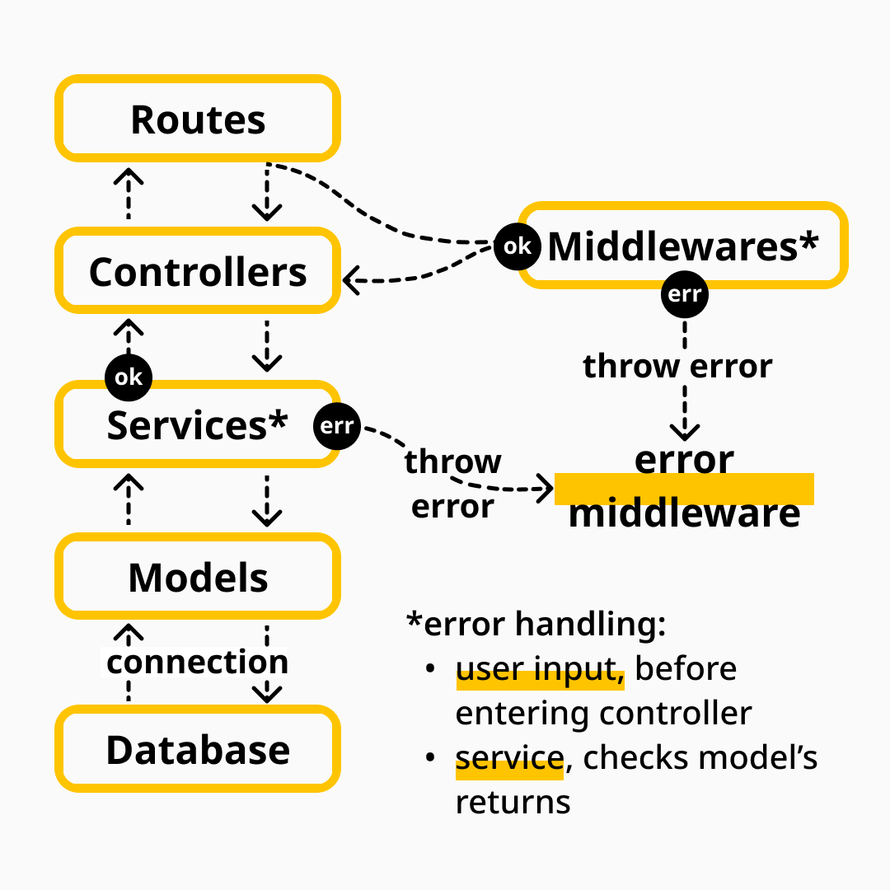

# Welcome to Store Manager project!
A RESTful API that uses MSC architecture to manage a Store's sales and products. Developed at [Trybe's](https://www.betrybe.com/) Back-end Module, Node.js architectures.


# Summary
- [Welcome to Store Manager project!](#welcome-to-store-manager-project)
- [Summary](#summary)
- [Context](#context)
- [Technologies, tools and architectures used](#technologies-tools-and-architectures-used)
- [Installing and running the app](#installing-and-running-the-app)
- [Notes](#notes)
  - [Documentation](#documentation)
  - [Code quality](#code-quality)
  - [Git, GitHub and Commits](#git-github-and-commits)


# Context
This project is a CRUD __Store API__ that connects with a MySQL database to manage sales and products from a store. The user is allowed to:
 * __Create__ new Products and Sales | Both have validations for user input and Sales has a validation that checks if the product sold exists in the database.
 * __Read__ all Products and Sales or search by Id.
 * __Update__ a Product or Sale | Both have validation to check if said item exists in the database.
 * __Delete__ a Product or Sale Id.


# Technologies, tools and architectures used
This project used the following technologies and tools:
  * __Node.js, Express, Nodemon, Joi__ | [Create a HTTP API](http://expressjs.com/), [API routing](https://expressjs.com/en/guide/routing.html), [error handling](https://www.npmjs.com/package/express-async-errors), [improve API development](https://www.npmjs.com/package/nodemon), [data validation](https://joi.dev/api/?v=17.6.0).
  * __Mocha, Chai, Sinon__ | [TDD and unit testing for Node.js](https://mochajs.org/).
  * __MySQL__ | [Creating and managing databases](https://www.mysqltutorial.org/).
  * __MSC__ | [Improve code organization, maintenance and scalability](https://martinfowler.com/architecture/).
  * __REST__ | [Simple architecture and highly popular](https://restfulapi.net/).

*Store Manager MSC architecture diagram.*



# Installing and running the app
### Install dependencies
```
cd store-manager
npm install
```
### Run the application without Docker
Don't forget to create and setup an `.env` file to connect to your local MySQL.

```
cd store-manager
npm run debug
```

### Run the application with Docker (compose configs were developed by Trybe's team)
```
cd store-manager
docker-compose up -d
docker exec -it store_manager bash
npm install
npm run debug
```

### Run Tests
```
npm run test:mocha
```

### Run Lint
```
npm run lint
```

# Notes
## Documentation
API's documentation can be [found here](https://documenter.getpostman.com/view/22534963/2s7YfGDwwG).
## Code quality
To enforce Clean Code and good practices, the following standards and resources were used in this project:
* __TDD__ | Using Test Driven Development with a high coverage to guarantee good architecture and expected behaviors.
* __Linter__ | Developed following the Clean Code standards specified by [Trybe's ESLint](https://github.com/betrybe/eslint-config-trybe).
* __SonarCloud__ | Passing [SonarCloud's](https://sonarcloud.io/) quality standards and analysis. Check the evaluation [here](https://sonarcloud.io/project/overview?id=ibrahimborba_store-manager).
## Git, GitHub and Commits
Commited using the [Conventional Commits specification](https://www.conventionalcommits.org/en/v1.0.0/) with some types from [Angular convention](https://github.com/angular/angular/blob/22b96b9/CONTRIBUTING.md#-commit-message-guidelines).

